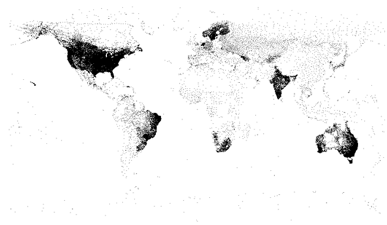

# metScanR


[](https://cran.rstudio.com/web/packages/metScanR/index.html) 
[](http://cran.r-project.org/package=metScanR)


## Summary 

Thousands of meteorological and environmental stations collect data everyday throughout the world. Collectively, these stations are part of hundreds of large-, medium-, and small-scale networks from around the globe.  Some stations are part of multiple networks, have well documented metadata, and their data can be accessed through a handfull of public databases.  Other stations however, have poorly documented metadata and their data are harder to locate and access. As a result varying metadata and documentation, data formats, station names and even inconsistent station identifiers can pose a major roadblock to finding, wrangling, and synthesizing meteorological and environmental data among different networks.  Here, we introduce *metScanR*, an R package that enables users to quickly locate freely available meteorological and environmental data across multiple networks, worldwide. The *metScanR* package utilizes a continuously growing database (see the [*metScanR database (DB)*](#refDatabase) section below), that contains metadata for **>100,000** stations from **219** countries/territories, worldwide (Fig 1). 




*metScanR* allows a user to search for stations and metadata in a variety of ways via the R functions within the package.  Below is a list of *metScanR* functions and their use.

**Filtering Functions**

These functions allow the end-user to filter environmental stations by:

* Residing country - `getCountry()` 
* Active date(s) - `getDates()`  
* Station Elevation - `getElevation()`
* Identifier type - `getId()`
* Nearby a Point of Interest (POI) - `getNearby()` 
* Network - `getNetwork()`
* Specific Station - `getStation()`  
* Meteorological / Environmental variables measurered - `getVars()`
* Hybrid search (all of the above) - `siteFinder()`

use of any of the above functions will return an R `list()` object detailing of all weather stations that meet the search criteria.  The following metadata is returned for each station:

* *$namez* [chr] - Name of the station 
* *$identifiers* [data.frame] - Station identifiers, including idType (i.e., the governing body that supplies the station ID such as the World Meteorological Organization) and the associated *id* 
* *platform* [chr] - The primary network or platform that the station belongs to
* *elements* [data.frame] - The meteorological/environmental variables measured at the station, includes the start and end dates of active sampling for each variable (if available)
* *location* [data.frame] - Geolocation information, inlcuding lat/lon, elevation, country, etc., for the site 

**Mapping Function**

*metScanR* also empowers users to explore data by providing an interactive map of all returned MET stations (powered by Leaflet). This is accomplished through *metScanR's* `mapSiteFinder()` function.

### Getting Started:

Install official releases from CRAN with 

```
install.packages("metScanR")
```
If you encounter a bug, please provide a reproducible example on this package's [github issues](https://github.com/jaroberti/metScanR/issues) page. 

### Tutorial:

A tutorial is provided at: https://jaroberti.github.io/metScanR/tutorials/intro.html

### The metScanR Database: <a id="refDatabase"></a>

The current version of the *metScanR DB* is *v2.2.0* and currently contains metadata from **107,126 stations**, worldwide. The DB is updated frequently and hosted externally of the *metScanR* package.  Upon loading the *metScanR* package via `library(metScanR)`, the DB is accessed via internet connection and installed locally to the user's computer.  The provenance of the DB is detailed below:

* **v1.0.0**  *2017-01-18* Initial release.  Database was in dataframe format and hosted with the R package.  Database comprised ~13,000 sites from the US and parts of Canada.
* **v2.0.0** *2017-05-18* Major release.  Database converted to list format with content (below). Database contains 106,933 stations from around the world and is hosted externally and independent from the *metScanR* package.  The new list format now includes:

- `$namez` - station name [character]
- `$identifiers` - station id(s) and idType(s) [data.frame]
- `$platform` - Primary platform (network) that the station belongs to [character] 
- `$elements`- element type (e.g., precipitation) and active sampling dates for element [data.frame]
- `$location` - geolocation metadata, e.g., lat/lon, elevation, etc. [data.frame]

* **v2.1.0** *2017-07-03* Minor release. NADP and Ameriflux networks added to DB. Database contains 107,624 stations, worldwide.

* **v2.2.0** *2017-11-05* Minor release. Identified 498 stations as duplicate entries, removed from DB.  DB now contains 107,126 worldwide stations.  Attributes (above comment) added to DB.  Will use these as checks to ensure user has most up-to-date version installed

### Future Directions:

We're hoping to enable metScanR with functionality for directly downloading meteorological and environmental data via existing APIs. 

### Citation:
Josh Roberti, Cody Flagg, Lee Stanish and Robert Lee (2017). metScanR: Find, Map, and
  Gather Environmental Data and Metadata. R package version 1.1.1.
  https://github.com/jaroberti/metScanR

