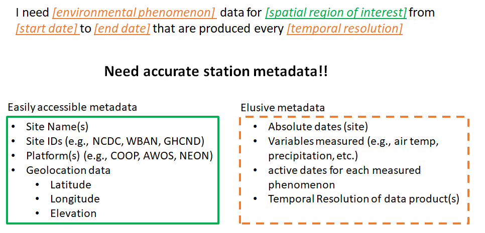
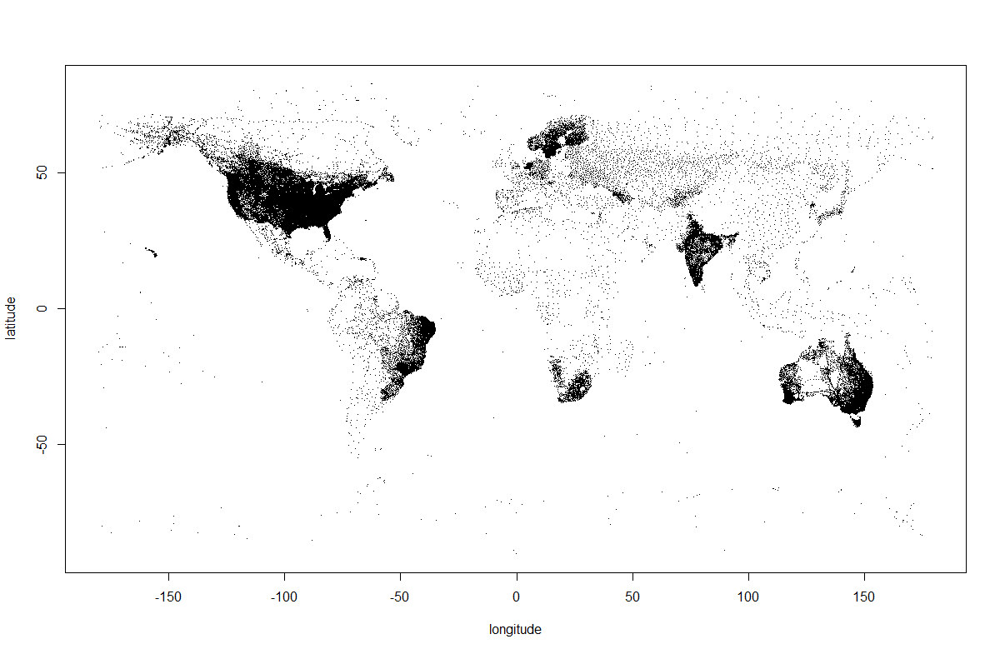
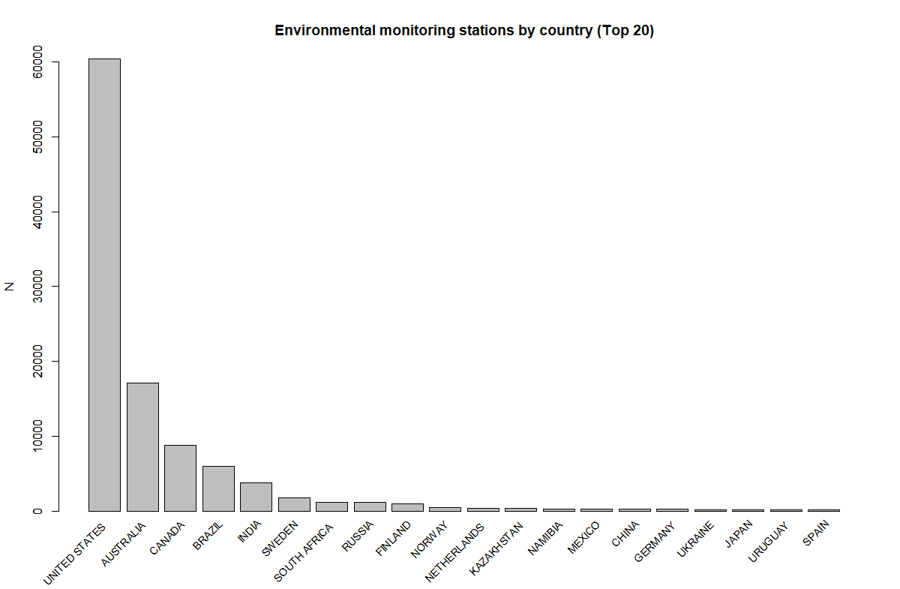
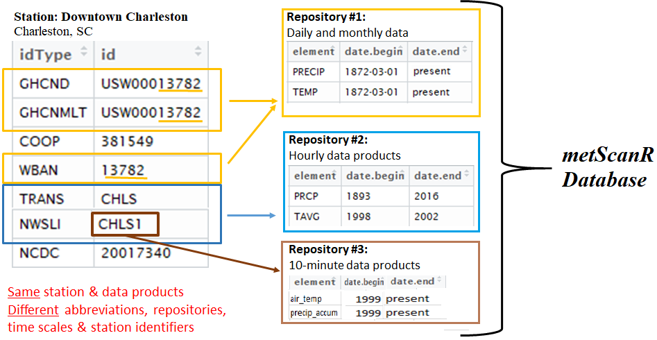
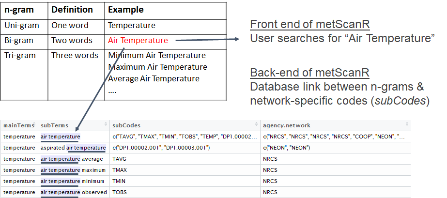

# metScanR

[](https://cran.rstudio.com/web/packages/metScanR/index.html) 
[](http://cran.r-project.org/package=metScanR)


**UPDATE 2018-03-19:** The *metScanR* package now includes a small (subset) database when initially downloaded.  To get the full benefits of *metScanR*, the end-user is encouraged to run the newly added `updateDatabase()` function within *metScanR* to ensure that the full and most up-to-date *metScanR database* is installed on their local computer.  


## Summary 

Thousands of meteorological and environmental stations collect data everyday throughout the world. Collectively, these stations are part of hundreds of large-, medium-, and small-scale networks from around the globe.  Some stations are part of multiple networks, have well documented metadata, and their data can be accessed through a handfull of public databases.  Other stations however, have poorly documented metadata and their data are harder to locate and access, which can make it difficult to answer specific scientific questions (Fig 1). 


<sup>**FIGURE 1** Some metadata are easy to find in many repositories (green box), while other types of metadata are hard to track down (orange box).  This can make searching for environmental monitoring stations of interest painstakingly slow especially if searching for specific criteria.</sup>


As a result, varying metadata, documentation, data formats, station names and even inconsistent station identifiers can pose a major roadblock to finding, wrangling, and synthesizing meteorological and environmental data among different networks.  Here, we introduce *metScanR*, an R package that enables users to quickly locate freely available meteorological and environmental data across multiple networks, worldwide. The *metScanR* package utilizes a continuously growing database (see the [*metScanR database (DB)*](#refDatabase) section below), that contains metadata for **>100,000** stations from **219** countries/territories, worldwide (Fig 2). 


<sup>**FIGURE 2**: Plot of all stations within the metScanR database.  Each station is represented by a dot. Station locations are the only items plotted here - no geographical or political boundaries are mapped.  This reveals interesting patterns about environmental station placement, e.g., northern Canada, India, central Australia, etc.  Below, a barplot details the number of stations per country.  Please note that only the top 20 countries in terms of number of environmental stations are shown.</sup>


<sup>**FIGURE 3**: Barplot of top 20 countries with the most environmental monitoring stations.</sup>

*metScanR* allows a user to search for stations and metadata in a variety of ways via the R functions within the package.  Below is a list of *metScanR* functions and their use.

**Filtering Functions**

These functions allow the end-user to filter environmental stations by:

* Specific country - `getCountry()` 
* Active date(s) - `getDates()`  
* Station Elevation - `getElevation()`
* Identifier type - `getId()`
* Nearby a Point of Interest (POI) - `getNearby()` 
* Network - `getNetwork()`
* Specific Station - `getStation()`  
* Meteorological / Environmental variables measurered - `getVars()`
* Specific US state or territory - `getTerritory()` 
* Hybrid search (all of the above) - `siteFinder()`

Use of any of the above functions will return an R `list()` object detailing of all weather/environmental stations that meet the search criteria.  Metadata of each station is structured in a standardized format (below) and is returned to the end-user when using the above search functions:

* *$namez* [chr] - Name of the station 
* *$identifiers* [data.frame] - Station identifiers, including idType (i.e., the governing body that supplies the station ID such as the World Meteorological Organization) and the associated *id* 
* *platform* [chr] - The primary network or platform that the station belongs to
* *elements* [data.frame] - The meteorological/environmental variables measured at the station, includes the start and end dates of active sampling for each variable (if available)
* *location* [data.frame] - Geolocation information, inlcuding lat/lon, elevation, country, etc., for the site 

**Mapping Function**

The *metScanR* package also comes with a function (`mapSiteFinder()`) that displays stations from a user-defined search (Figure 4).  The map is interactive (when run in R; below is just a screenshot) and users can click on stations for more information and/or toggle different areas by zooming in/out etc. This is an aesthetic, ancillary feature to compliment the many search functions available within the package.

 function.")

<sup>**FIGURE 4:** Screenshot example of metScanR's mapSiteFinder() function.</sup> 

### Getting Started:

Install official releases from CRAN with 

```
#install metScanR:
install.packages("metScanR")
#download and save the most up-to-date database:
updateDatabase()

```
If you encounter a bug, please provide a reproducible example on this package's [github issues](https://github.com/jaroberti/metScanR/issues) page. 

### Tutorial:

A tutorial is provided at: https://jaroberti.github.io/metScanR/tutorials/intro.html

### CRAN PDF: 
https://cran.r-project.org/web/packages/metScanR/metScanR.pdf

### The metScanR Database: <a id="refDatabase"></a>

The current version of the *metScanR DB* is *v2.2.0* and currently contains metadata from **107,126 stations**, worldwide. The DB is updated frequently and hosted externally of the *metScanR* package.  Upon loading the *metScanR* package via `library(metScanR)`, the DB is accessed via internet connection and installed locally to the user's computer.  The provenance of the DB is detailed below:

* **v1.0.0**  *2017-01-18* Initial release.  Database was in dataframe format and hosted with the R package.  Database comprised ~13,000 sites from the US and parts of Canada.
* **v2.0.0** *2017-05-18* Major release.  Database converted to list format with content (below). Database contains 106,933 stations from around the world and is hosted externally and independent from the *metScanR* package.  The new list format now includes:

- `$namez` - station name [character]
- `$identifiers` - station id(s) and idType(s) [data.frame]
- `$platform` - Primary platform (network) that the station belongs to [character] 
- `$elements`- element type (e.g., precipitation) and active sampling dates for element [data.frame]
- `$location` - geolocation metadata, e.g., lat/lon, elevation, etc. [data.frame]

* **v2.1.0** *2017-07-03* Minor release. NADP and Ameriflux networks added to DB. Database contains 107,624 stations, worldwide.

* **v2.2.0** *2017-11-05* Minor release. Identified 498 stations as duplicate entries, removed from DB.  DB now contains 107,126 worldwide stations.  Attributes (above comment) added to DB.  Will use these as checks to ensure user has most up-to-date version installed  


###Novelty:
Because meteorological/environmental networks are managed by different governing bodies, an abundance of discrepancies exist within station metadata.  A single station may be part of many networks, can have many associated identifiers, and may have similar data product-types (i.e., variables monitored) stored among many repositories which are available at different temporal resolutions.  As such, a user may find a station of interest, and depending on the station identifier that they use, may be routed to a repository that contains only a fraction of the available station inforation (see Figure 5). This results in a  "discrepancy gap" of data avaiability among the thousands of meteorological/environmental stations, worldwide.  The *metScanR* package attempts to bridge the 'discrepancy gap.' This is acheived by organizing all information into a standardized and single database, i.e., the *metScanR database*.  



<sup>**FIGURE 5:** An example of metadata discrepancies for a single station: 'Downtown Charleston' in Charleston, SC, USA.  This station has many associated identifiers which route to repositories managed by different governing bodies with varying metadata standards.</sup> 

This gap extends also to measured variables (e.g., air temperature, soil moisture, snow depth, etc.) among networks. To alleviate this discrepancy and make elemets traceable to one another, elements within the *metScanR database* are structured using a hierarchical n-gram structure that links common terms to network-specific element codes.  This accounts for nomenclature discrepancies and allows users to search for a variety of like-elements in one search, a novel approach for structuing and storing meteorological/environmental metadata (Figure 5).  


<sup>**FIGURE 6:** Linking the many network-specific variable abbreviations to common terms.</sup>  


### Future Directions:

We're hoping to:

1. Enable metScanR with functionality for directly downloading meteorological and environmental data via existing APIs.
2. Build a web-based platform for users not familiar with the R programming language.

### Citation:
```
citation("metScanR")
```

  Josh Roberti, Cody Flagg, Lee Stanish and Robert Lee (2018). metScanR: Find, Map, and Gather Environmental Data
  and Metadata. R package version 1.2.0. https://CRAN.R-project.org/package=metScanR

### Meet the team:
[Josh Roberti](https://www.linkedin.com/in/josh-roberti-09297946/)

[Cody Flagg](https://www.linkedin.com/in/cody-flagg-12354765/)

[Lee Stanish](https://www.linkedin.com/in/lee-stanish-3698971a/)

[Robert Lee](https://www.linkedin.com/in/robert-lee-a51163bb/)


### Presentations:
[Click here](https://ams.confex.com/ams/98Annual/videogateway.cgi/id/44605?recordingid=44605&uniqueid=Paper336096&entry_password=164273) to check out our presentation from the American Meteorological Society's (AMS) Annual Meeting (2018-01-10) in Austin, TX.
